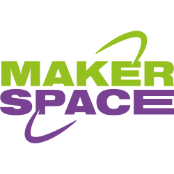

# Makerspace SD-Lab – Een digitaal platform voor creativiteit en samenwerking

Voor het Makerspace-platform van SD-Lab hebben wij een moderne webapplicatie ontwikkeld waarmee studenten eenvoudig workshops kunnen volgen, apparatuur kunnen huren en ruimtes kunnen reserveren. Het doel van het platform was om een centrale digitale omgeving te creëren waarin technologie, creativiteit en samenwerking samenkomen.

Bij de ontwikkeling van het platform hebben we gebruikgemaakt van verschillende moderne technologieën en frameworks om zowel gebruiksvriendelijkheid als schaalbaarheid te garanderen.

## Functionaliteiten van het platform

Het platform biedt studenten de mogelijkheid om:

- Zich aan te melden voor workshops en evenementen
- Apparatuur te reserveren en te huren
- Makerspace-lokalen te boeken voor projecten en samenwerking
- Hun reserveringen en activiteiten overzichtelijk te beheren

Daarnaast biedt het systeem beheerders de mogelijkheid om workshops, apparatuur en ruimtes efficiënt te beheren vanuit één centrale omgeving.

## Technologieën

Voor de backend hebben we gebruikgemaakt van **Laravel**, waarmee we een stabiele en schaalbare architectuur konden opzetten. Laravel bood krachtige tools voor authenticatie, routing, databasebeheer en API-functionaliteit.

Voor authenticatie hebben we **Microsoft Authentication** geïntegreerd, zodat studenten veilig kunnen inloggen met hun bestaande onderwijsaccounts. Hierdoor werd de drempel voor gebruik laag gehouden en kon het platform eenvoudig aansluiten op bestaande systemen binnen de onderwijsomgeving.

Andere technologieën en tools die tijdens het project zijn gebruikt:

- Laravel
- Microsoft Authentication / OAuth
- MySQL
- REST API’s
- Frontend-technologieën voor een responsieve gebruikerservaring
- Role-based access control voor beheerfunctionaliteiten

## Focus op gebruikservaring

Tijdens de ontwikkeling lag de focus sterk op eenvoud en toegankelijkheid. Studenten moesten zonder ingewikkelde stappen direct gebruik kunnen maken van het systeem. Daarom is veel aandacht besteed aan een duidelijke interface, snelle workflows en overzichtelijke reserveringsprocessen.

## Resultaat

Het eindresultaat is een flexibel en schaalbaar platform dat studenten ondersteunt bij creatief en technisch samenwerken binnen de Makerspace. Door digitale processen te centraliseren wordt het beheren van workshops, apparatuur en ruimtes aanzienlijk eenvoudiger voor zowel studenten als beheerders.

